# SMART SUPPLY SOURCING PLATFORM — ALL DIAGRAMS (MERMAID FORMAT)

This file contains all diagrams from the research documentation converted to Mermaid format, organized by chapter and diagram type.

---

## CHAPTER 4 — CURRENT SYSTEM DIAGRAMS

---

### Figure 4.1 — Context Diagram: Current Industrial Equipment Sourcing System

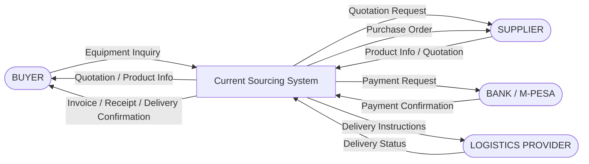

---

### Figure 4.2 — DFD Level 0: Current Industrial Equipment Sourcing System

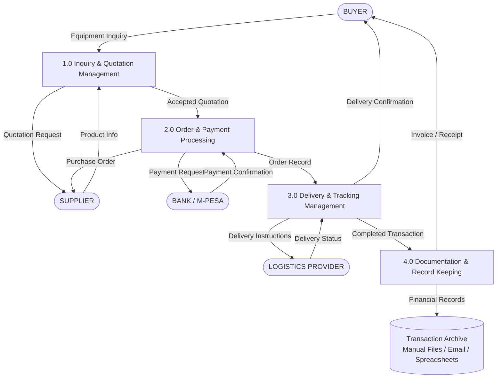

---

### Figure 4.3 — DFD Level 1: Order Processing (Expansion of Process 2.0)

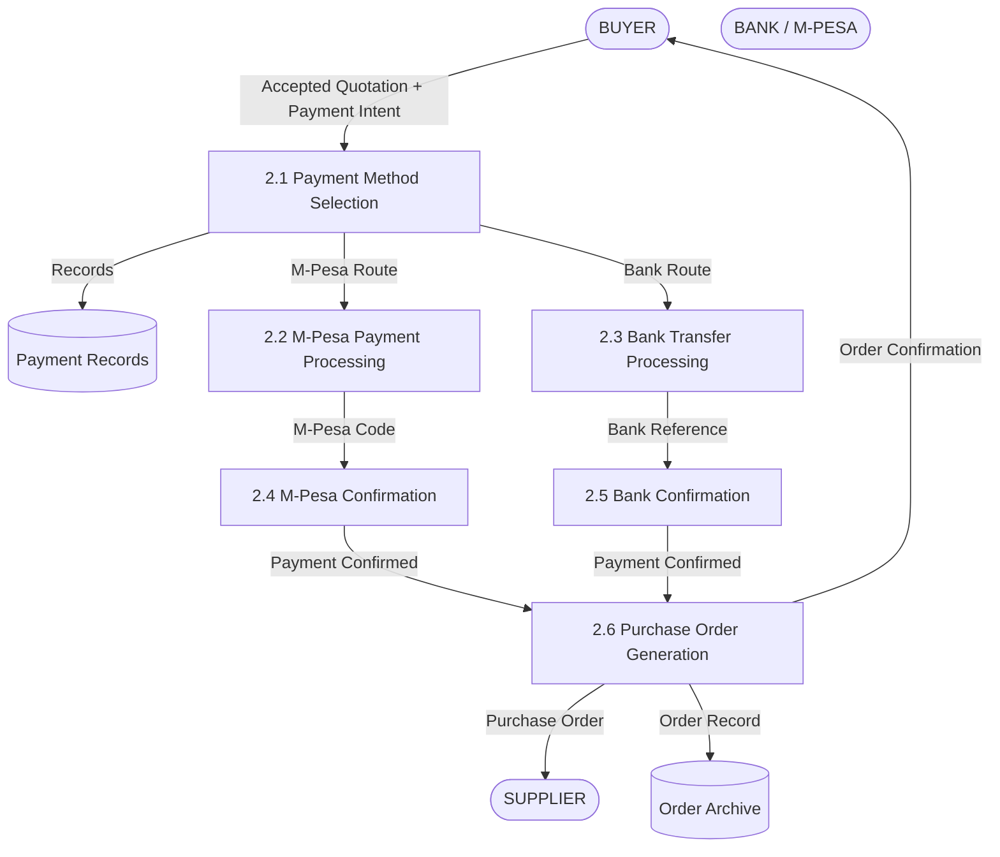

---

### Figure 4.4 — Flowchart: Manual Payment Reconciliation Process

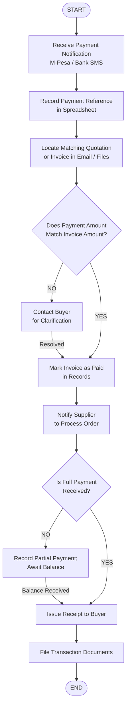

---

### Figure 4.5 — Flowchart: Sourcing Request Handling Process

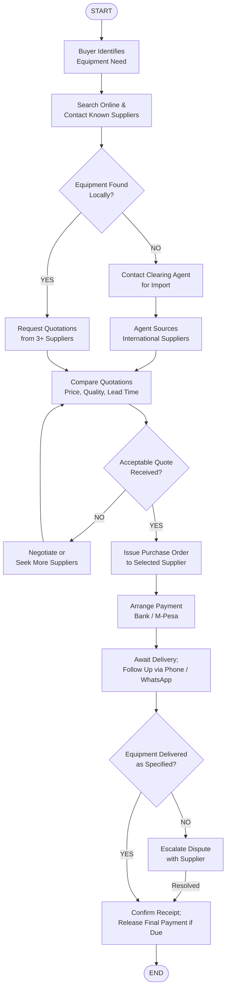


---

## CHAPTER 5 — PROPOSED SYSTEM DIAGRAMS

---

### Figure 5.1 — Use Case Diagram: Buyer Module

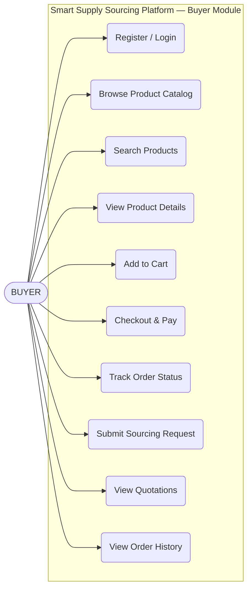

---

### Figure 5.2 — Use Case Diagram: Admin Module

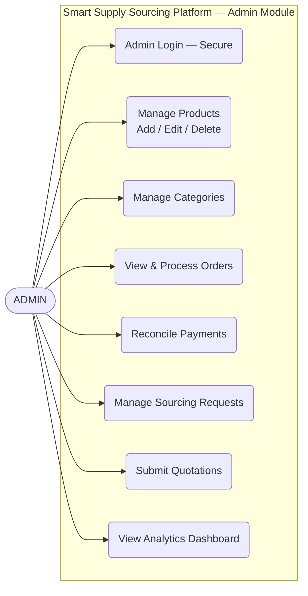

---

### Figure 5.3 — Use Case Diagram: Payment Module

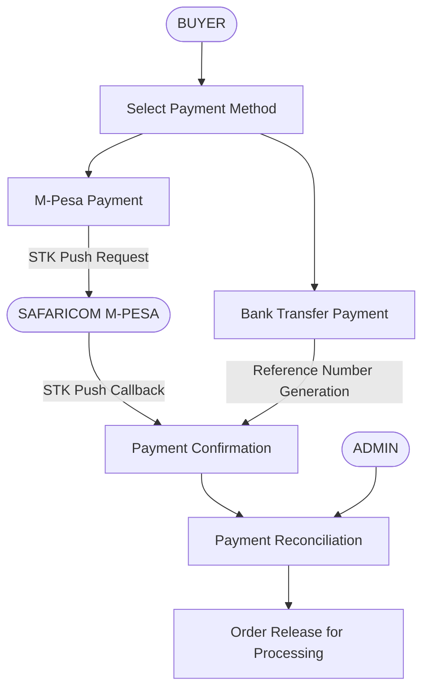

---

### Figure 5.4 — Activity Diagram: User Registration

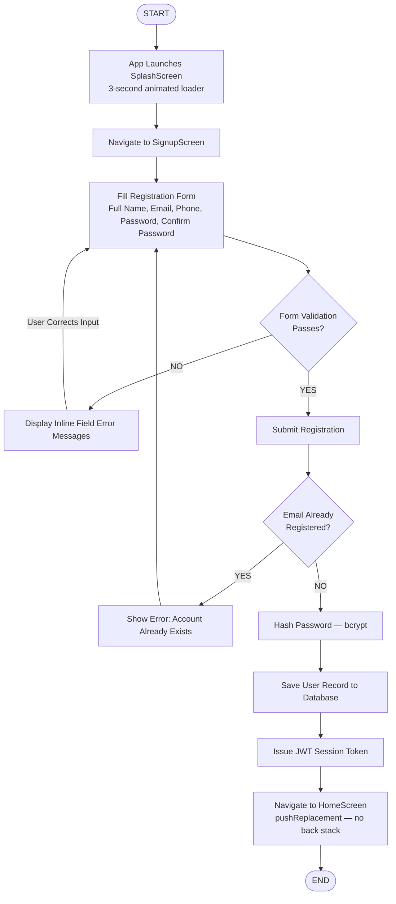

---

### Figure 5.5 — Activity Diagram: Product Ordering (Flutter Mobile App)

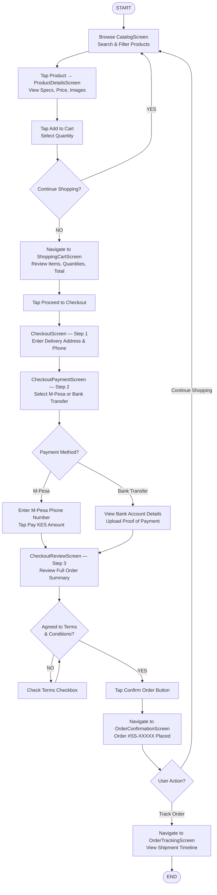

---

### Figure 5.6 — Activity Diagram: Sourcing Request

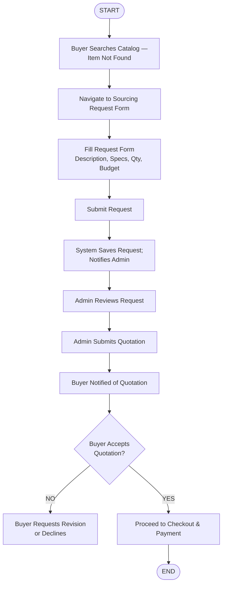


---

### Figure 5.7 — Sequence Diagram: User Authentication (Flutter Mobile App)

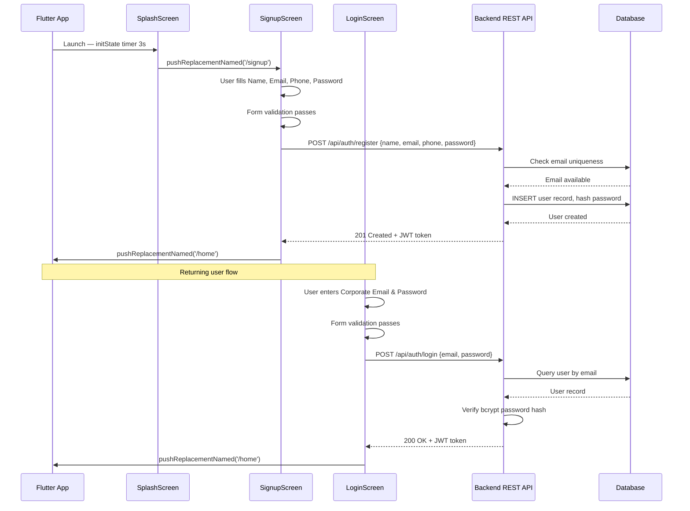

---

### Figure 5.8 — Sequence Diagram: Add to Cart (Flutter Mobile App)

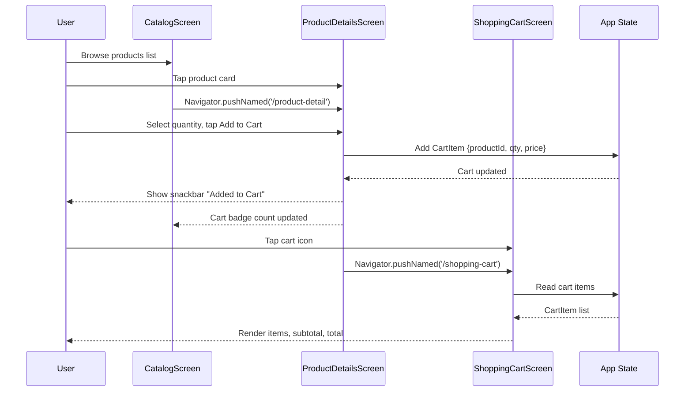

---

### Figure 5.9 — Sequence Diagram: M-Pesa Payment Processing (Flutter Mobile App)

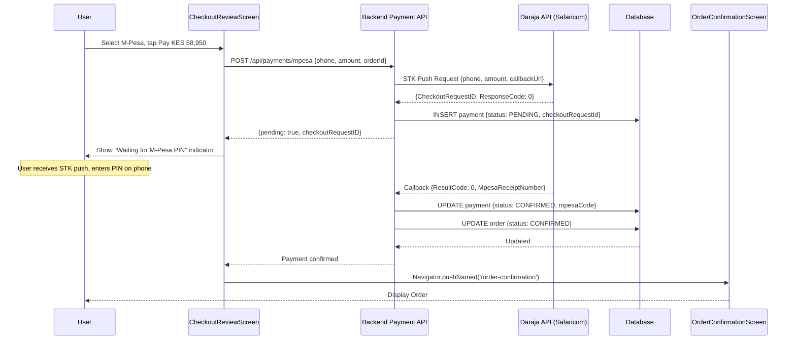

---

### Figure 5.10 — Sequence Diagram: Order Tracking (Flutter Mobile App)

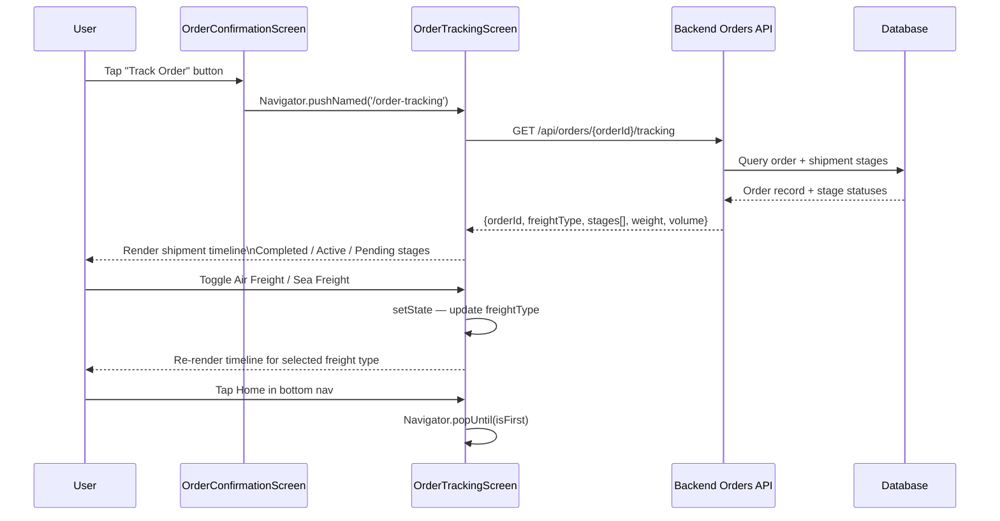


---

### Figure 5.11 — Class Diagram: User and Authentication

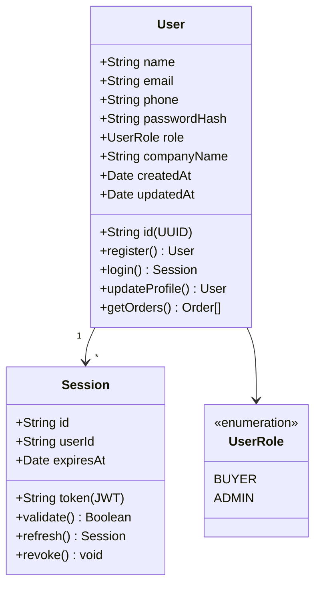

---

### Figure 5.12 — Class Diagram: Product and Category

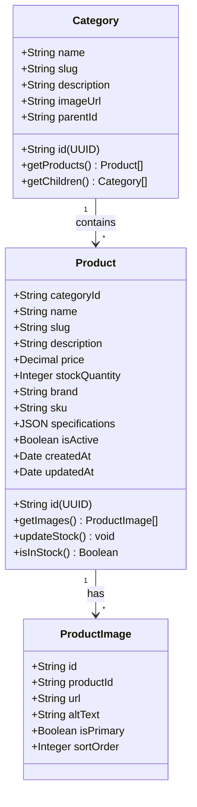

---

### Figure 5.13 — Class Diagram: Order and Payment

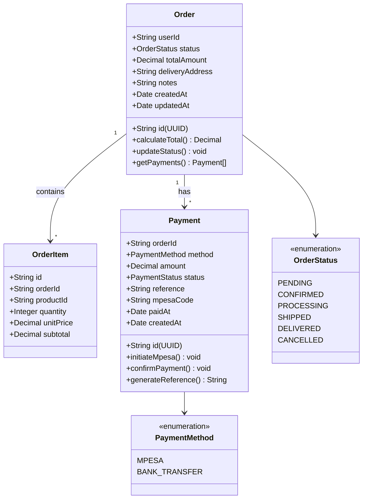


---

### Figure 5.14 — Context Diagram: Proposed Smart Supply Sourcing Platform

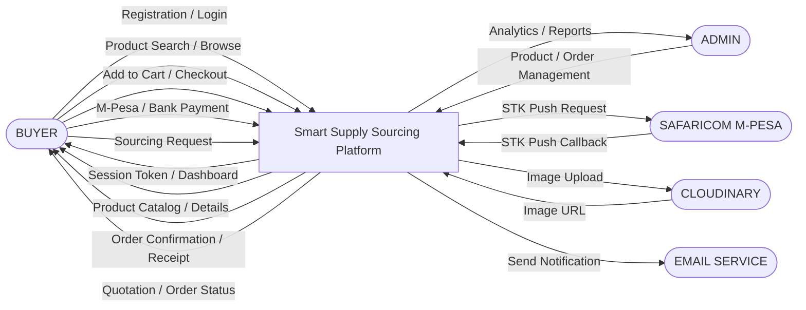

---

### Figure 5.15 — DFD Level 0: Proposed Smart Supply Sourcing Platform

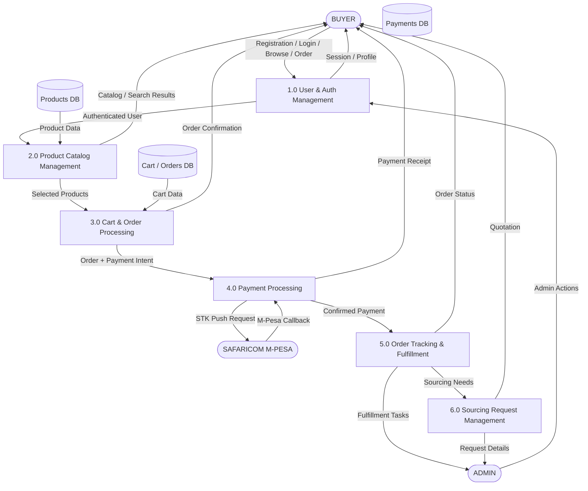

---

### Figure 5.16 — DFD Level 1: User Management

```mermaid
flowchart TD
    BUYER([BUYER])
    EMAIL_SVC([EMAIL SERVICE])
    D1[(Users Table — PostgreSQL)]

    BUYER -->|Registration Data| P11[1.1 Registration Processing]
    P11 -->|Hashed Password| D1
    P11 -->|Welcome Email| EMAIL_SVC

    P11 -->|User Record Created| P12[1.2 Authentication — NextAuth.js]
    D1 -->|User Record| P12
    P12 -->|JWT Session Token| BUYER

    P12 -->|Authenticated Session| P13[1.3 Profile Management]
    D1 -->|Profile Data| P13
    P13 -->|Updated Profile| BUYER
```

---

### Figure 5.17 — DFD Level 1: Order Management

```mermaid
flowchart TD
    BUYER([BUYER])
    ADMIN([ADMIN])
    EMAIL_SVC([EMAIL SERVICE])
    D2[(Products Table)]
    D3[(Orders Table)]
    D4[(Payments Table)]

    BUYER -->|Cart Contents + Delivery Details| P31[3.1 Order Creation]
    D2 -->|Product Prices| P31
    P31 -->|Order Record| D3

    P31 -->|Order ID| P32[3.2 Order Confirmation]
    D4 -->|Payment Confirmation| P32
    P32 -->|Confirmation Email| EMAIL_SVC
    P32 -->|Order Status: CONFIRMED| D3

    P32 -->|Confirmed Order| P33[3.3 Order Status Management]
    ADMIN -->|Admin Update| P33
    P33 -->|Status Update| D3
    P33 -->|Status Email| BUYER
```

---

### Figure 5.18 — DFD Level 1: Payment Management

```mermaid
flowchart TD
    BUYER([BUYER])
    ADMIN([ADMIN])
    SAFARICOM([SAFARICOM M-PESA])
    D3[(Orders Table)]
    D4[(Payments Table)]

    BUYER -->|Payment Method + Amount| P41[4.1 Payment Method Routing]
    P41 -->|M-Pesa Route| P42[4.2 M-Pesa STK Push Processing]
    P41 -->|Bank Route| P43[4.3 Bank Transfer Processing]

    P42 -->|STK Push Request| SAFARICOM
    SAFARICOM -->|Callback| P44[4.4 Payment Confirmation]
    P43 -->|Reference Number| D4
    D4 -->|Bank Record| P44

    P44 -->|Payment Record| D4
    P44 -->|Order Update| D3

    P44 -->|Confirmed Payment| P45[4.5 Payment Reconciliation]
    ADMIN -->|Admin Action| P45
    P45 -->|Reconciled Status| D4
    P45 -->|Receipt| BUYER
```


---

### Figure 5.19 — Entity-Relationship Diagram: Smart Supply Sourcing Platform

```mermaid
erDiagram
    users {
        UUID id PK
        VARCHAR name
        VARCHAR email
        VARCHAR phone
        VARCHAR password_hash
        VARCHAR role
        VARCHAR company_name
        TIMESTAMP created_at
        TIMESTAMP updated_at
    }

    categories {
        UUID id PK
        VARCHAR name
        VARCHAR slug
        TEXT description
        UUID parent_id FK
        VARCHAR image_url
        TIMESTAMP created_at
    }

    products {
        UUID id PK
        UUID category_id FK
        VARCHAR name
        VARCHAR slug
        TEXT description
        DECIMAL price
        INTEGER stock_quantity
        VARCHAR brand
        VARCHAR sku
        JSONB specifications
        BOOLEAN is_active
        TIMESTAMP created_at
        TIMESTAMP updated_at
    }

    product_images {
        UUID id PK
        UUID product_id FK
        VARCHAR url
        VARCHAR alt_text
        BOOLEAN is_primary
        INTEGER sort_order
    }

    orders {
        UUID id PK
        UUID user_id FK
        VARCHAR status
        DECIMAL total_amount
        TEXT delivery_address
        TEXT notes
        TIMESTAMP created_at
        TIMESTAMP updated_at
    }

    order_items {
        UUID id PK
        UUID order_id FK
        UUID product_id FK
        INTEGER quantity
        DECIMAL unit_price
        DECIMAL subtotal
    }

    payments {
        UUID id PK
        UUID order_id FK
        VARCHAR method
        DECIMAL amount
        VARCHAR status
        VARCHAR reference
        VARCHAR mpesa_code
        VARCHAR checkout_request_id
        TIMESTAMP paid_at
        TIMESTAMP created_at
    }

    sourcing_requests {
        UUID id PK
        UUID user_id FK
        VARCHAR title
        TEXT description
        INTEGER quantity
        DECIMAL budget
        VARCHAR status
        TIMESTAMP created_at
        TIMESTAMP updated_at
    }

    quotes {
        UUID id PK
        UUID request_id FK
        DECIMAL amount
        INTEGER lead_time_days
        TEXT notes
        VARCHAR status
        TIMESTAMP created_at
    }

    users ||--o{ orders : "places"
    users ||--o{ sourcing_requests : "submits"
    categories ||--o{ products : "contains"
    categories ||--o{ categories : "parent of"
    products ||--o{ product_images : "has"
    products ||--o{ order_items : "included in"
    orders ||--o{ order_items : "contains"
    orders ||--o{ payments : "paid via"
    sourcing_requests ||--o{ quotes : "receives"
```

---

### Figure 5.20 — Navigation Flow Diagram (Flutter Mobile App)

```mermaid
flowchart TD
    SPLASH[SplashScreen\n3-second loader] --> SIGNUP[SignupScreen\nCreate Account]

    SIGNUP -->|Create Account| HOME[HomeScreen]
    SIGNUP -->|Log In link| LOGIN[LoginScreen]
    LOGIN -->|Sign In| HOME
    LOGIN -->|Request Access| SIGNUP

    HOME --> CATALOG[CatalogScreen\nProduct Catalog]
    HOME --> REQUESTS_LIST[RequestsListScreen\nSourcing Requests]
    HOME --> ACCOUNT[AccountScreen\nUser Profile & Metrics]

    CATALOG --> PRODUCT[ProductDetailsScreen\nProduct Detail]
    PRODUCT --> CART[ShoppingCartScreen\nCart Review]

    CART --> CHECKOUT[CheckoutScreen\nStep 1 — Shipping Address]
    CHECKOUT --> PAYMENT[CheckoutPaymentScreen\nStep 2 — Payment Method]
    PAYMENT --> REVIEW[CheckoutReviewScreen\nStep 3 — Order Review]
    REVIEW -->|Confirm Order| ORDER_CONFIRM[OrderConfirmationScreen\nOrder Placed Successfully]
    ORDER_CONFIRM -->|Track Order| TRACKING[OrderTrackingScreen\nShipment Progress Timeline]
    ORDER_CONFIRM -->|Continue Shopping| HOME
    TRACKING -->|Home nav| HOME

    REQUESTS_LIST --> STEP1[NewRequestStep1Screen]
    STEP1 --> STEP2[NewRequestStep2Screen]
    STEP2 --> STEP3[NewRequestStep3Screen]
    STEP3 --> STEP4[NewRequestStep4Screen]
    STEP4 --> STEP5[NewRequestStep5Screen]
    STEP5 --> DRAFT[DraftSavedScreen]
    STEP5 --> QUOTE[QuoteReviewScreen]
```

---

### Figure 5.21 — Three-Tier Architecture Diagram (Flutter Mobile App)

```mermaid
graph TB
    subgraph PRESENTATION[Presentation Layer — Flutter Mobile Client]
        UI1[Flutter Screens & Widgets\n20 Screens across 6 Feature Modules]
        UI2[Material Design 3 Theming\nCustom AppColors & AppTextStyles]
        UI3[StatefulWidget State Management\nsetState & Navigator]
    end

    subgraph BUSINESS[Business Logic Layer — Backend REST API]
        BL1[RESTful API Endpoints]
        BL2[JWT Authentication & Authorization]
        BL3[M-Pesa Daraja STK Push Integration]
        BL4[Cloudinary Media Management]
        BL5[Email Notification Service]
    end

    subgraph DATA[Data Layer — Database]
        DB1[PostgreSQL]
        DB2[users Table]
        DB3[products & categories Tables]
        DB4[orders & order_items Tables]
        DB5[payments Table]
        DB6[sourcing_requests & quotes Tables]
    end

    subgraph EXTERNAL[External Services]
        EXT1[Safaricom Daraja API\nM-Pesa STK Push]
        EXT2[Cloudinary CDN\nProduct Images]
        EXT3[Email Provider\nOrder Notifications]
        EXT4[Google Play Store\nApp Distribution]
    end

    PRESENTATION <-->|HTTP / REST / JSON| BUSINESS
    BUSINESS <-->|SQL Queries| DATA
    BUSINESS <-->|API Calls| EXTERNAL
```

---

### Figure 5.22 — Technology Stack Diagram

```mermaid
graph LR
    subgraph MOBILE[Mobile Frontend]
        F1[Flutter SDK 3.x]
        F2[Dart Programming Language]
        F3[Material Design 3]
        F4[StatefulWidget / setState]
    end

    subgraph BACKEND[Backend / API]
        B1[RESTful API]
        B2[JWT Authentication]
        B3[Node.js / Python Runtime]
    end

    subgraph DATABASE[Database]
        D1[PostgreSQL]
        D2[Neon Serverless]
    end

    subgraph INTEGRATIONS[Third-Party Integrations]
        I1[Safaricom Daraja API\nM-Pesa STK Push]
        I2[Cloudinary\nImage Management]
        I3[Email Service\nTransactional Emails]
    end

    subgraph DEPLOYMENT[Deployment]
        DEP1[Google Play Store\nAndroid Distribution]
        DEP2[Apple App Store\niOS Distribution]
    end

    MOBILE --> BACKEND
    BACKEND --> DATABASE
    BACKEND --> INTEGRATIONS
    MOBILE --> DEP1
    MOBILE --> DEP2
```

---

*End of Diagrams — Smart Supply Sourcing Platform Research Documentation*
